# Jenkins CI/CD Pipeline with Java, Maven, Docker, Nexus Repository & AWS EC2

<div align="center">


</div>

---

## Project Overview

This repository documents the implementation of a production-inspired **Continuous Integration (CI) pipeline** built with **Jenkins**, **Java**, **Maven**, **Docker**, **Sonatype Nexus Repository**, and **AWS EC2**.

The project demonstrates how modern DevOps teams automate software builds, package applications into Docker images, and publish those images to a private artifact repository.

Rather than manually compiling code, building Docker images, and distributing artifacts, Jenkins automates the entire workflow whenever changes are made to the application's source code.

The complete environment was provisioned and configured on an **Ubuntu EC2 instance hosted on Amazon Web Services (AWS)**, providing hands-on experience with Linux administration, cloud infrastructure, CI automation, containerization, and artifact management.

This project also includes real-world troubleshooting scenarios encountered during implementation, making it a practical demonstration of problem-solving skills expected of DevOps Engineers.

---

## Project Objectives

The objectives of this project were to:

- Build an end-to-end Continuous Integration (CI) pipeline using Jenkins.
- Configure Jenkins on an AWS EC2 Ubuntu server.
- Integrate Jenkins with GitHub for source code management.
- Automate Java application builds using Maven.
- Package Java applications into executable JAR files.
- Build Docker images automatically after successful compilation.
- Configure Sonatype Nexus Repository as a private Docker Registry.
- Authenticate Jenkins with Nexus Repository.
- Push Docker images to a private artifact repository.
- Practice Linux system administration commands.
- Gain practical experience troubleshooting CI/CD pipeline failures.
- Produce professional documentation suitable for a DevOps portfolio.

---

# Solution Architecture

> **Replace this placeholder with your Draw.io architecture diagram.**


---

## CI Pipeline Workflow

The Continuous Integration workflow implemented in this project follows the sequence below:

```text
Developer
     │
     ▼
GitHub Repository
     │
     ▼
Jenkins Pipeline
     │
     ▼
Checkout Source Code
     │
     ▼
Maven Package
     │
     ▼
Docker Build
     │
     ▼
Docker Login
     │
     ▼
Push Docker Image
     │
     ▼
Sonatype Nexus Repository
```

This automated workflow eliminates repetitive manual tasks while ensuring every successful build produces a deployable Docker image stored in a centralized artifact repository.

---

# Technologies Used

| Technology | Purpose |
|------------|---------|
| AWS EC2 | Cloud Infrastructure |
| Ubuntu Linux | Operating System |
| Git | Version Control |
| GitHub | Source Code Repository |
| Jenkins | Continuous Integration |
| Java 17 | Application Development |
| Apache Maven | Build Automation |
| Docker | Containerization |
| Sonatype Nexus Repository | Docker Registry & Artifact Repository |
| Groovy | Jenkins Pipeline Scripting |
| SSH | Remote Server Administration |

---

# Repository Structure

```text
jenkins-cicd-pipeline/
│
├── Jenkinsfile
├── Dockerfile
├── pom.xml
├── README.md
├── LICENSE
├── .gitignore
│
├── src/
│   ├── main/
│   └── test/
│
├── docs/
│   ├── setup.md
│   ├── commands.md
│   ├── troubleshooting.md
│   ├── lessons-learned.md
│   ├── project-structure.md
│   └── video-script.md
│
├── assets/
│   ├── images/
│
└── 
```

---

# AWS Infrastructure

The entire CI environment was deployed and managed on an **Ubuntu EC2 instance** hosted on **Amazon Web Services (AWS)**.

Using a cloud-based environment allowed me to simulate a real-world DevOps infrastructure where build servers, artifact repositories, and automation tools are deployed on virtual machines instead of local systems.

The EC2 instance hosted the following services:

- Jenkins Automation Server
- Docker Engine
- Sonatype Nexus Repository
- Java Development Kit (JDK)
- Apache Maven
- Git

---

## Amazon EC2 Instance

The Jenkins server was provisioned on an Ubuntu EC2 instance.

### Responsibilities

- Hosting Jenkins
- Running Docker
- Building Java applications
- Managing Docker images
- Hosting Nexus Repository
- Executing CI jobs

### EC2 Dashboard

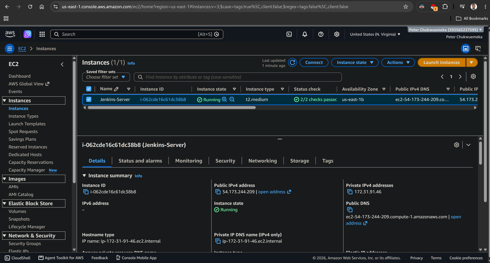

---

## Security Group Configuration

To allow external access to the required services, the following inbound rules were configured.

| Port | Service |
|------|---------|
| 22 | SSH |
| 8080 | Jenkins |
| 8081 | Nexus Repository UI |
| 8083 | Docker Hosted Registry |

### AWS Security Group

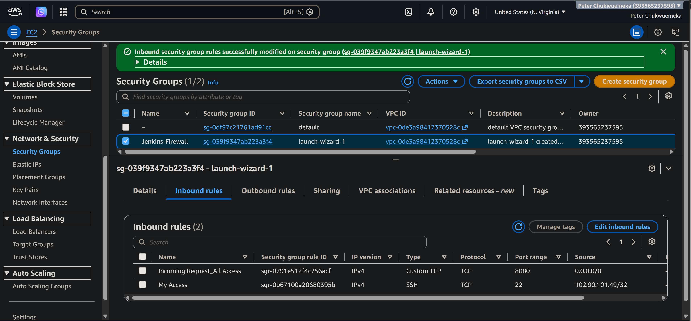

---

## SSH Connection

The EC2 instance was managed remotely using SSH.

Example command:

```bash
ssh -i my-key.pem ubuntu@<EC2-PUBLIC-IP>
```

### SSH Session

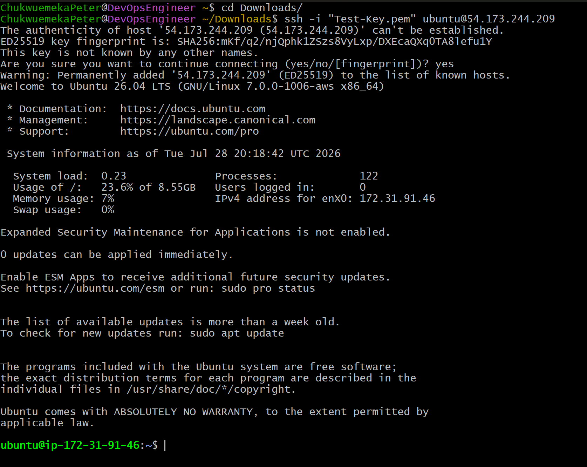

---

# Jenkins Installation

Jenkins served as the automation engine responsible for orchestrating the Continuous Integration workflow.

After launching the EC2 instance, Jenkins was installed, configured, and secured before creating the pipeline.

The installation process included:

- Installing Java
- Installing Jenkins
- Starting the Jenkins service
- Enabling Jenkins at boot
- Accessing Jenkins from a web browser
- Unlocking Jenkins
- Installing recommended plugins

---

## Jenkins Dashboard

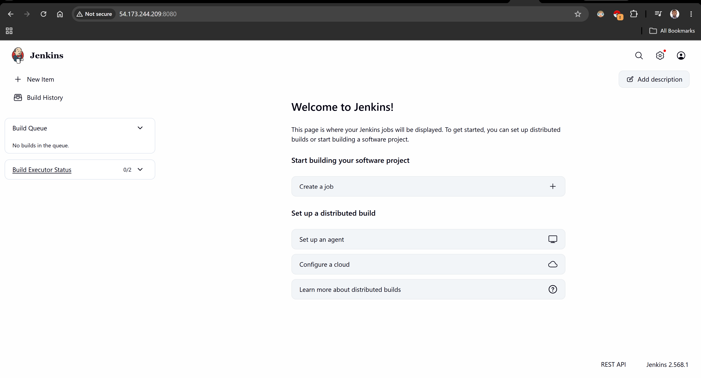

---

# Jenkins Plugins

Several plugins were installed to support the pipeline.

| Plugin | Purpose |
|---------|----------|
| Git Plugin | Clone GitHub repositories |
| Pipeline Plugin | Pipeline as Code |
| Credentials Plugin | Secure credential management |
| Maven Integration | Maven build support |
| Docker Pipeline | Docker automation |

### Installed Plugins

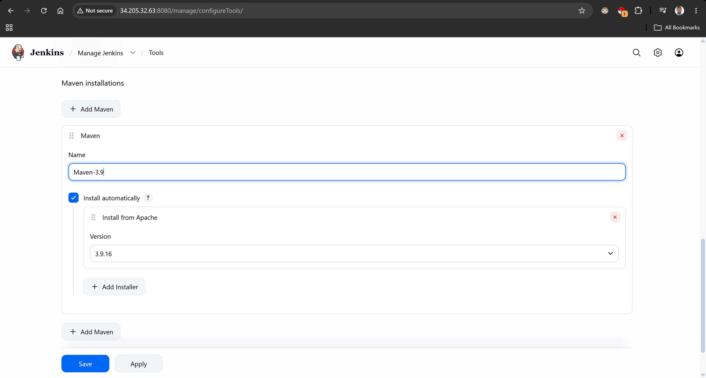

---

# Global Tool Configuration

Jenkins was configured with the required development tools.

Configured tools include:

- JDK
- Maven
- Git

This allows Jenkins to automatically invoke the correct versions during pipeline execution.

### Global Tool Configuration

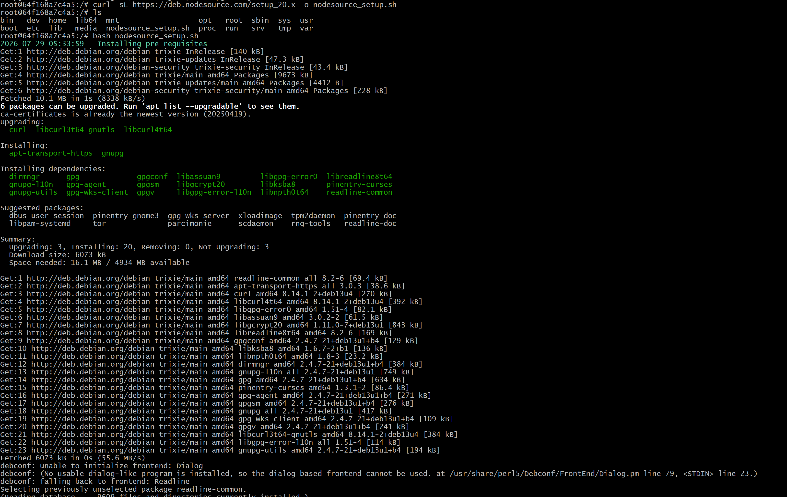

---

# Jenkins Credentials

To securely authenticate with external services, credentials were stored inside Jenkins instead of hardcoding usernames and passwords.

Credentials configured:

- GitHub Credentials
- Nexus Repository Credentials

This approach improves security while keeping the pipeline reusable and maintainable.

### Jenkins Credentials

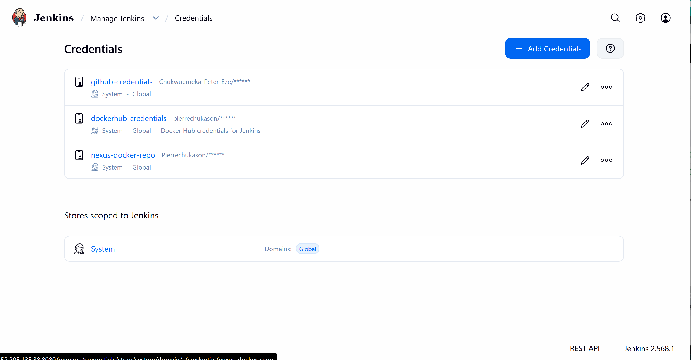

---

# Jenkins Job Configuration

A Pipeline Job was created to automate the build process.

The job was configured to:

- Pull source code from GitHub
- Execute Maven build
- Build Docker image
- Authenticate with Nexus Repository
- Push Docker image to Nexus

### Jenkins Job Configuration

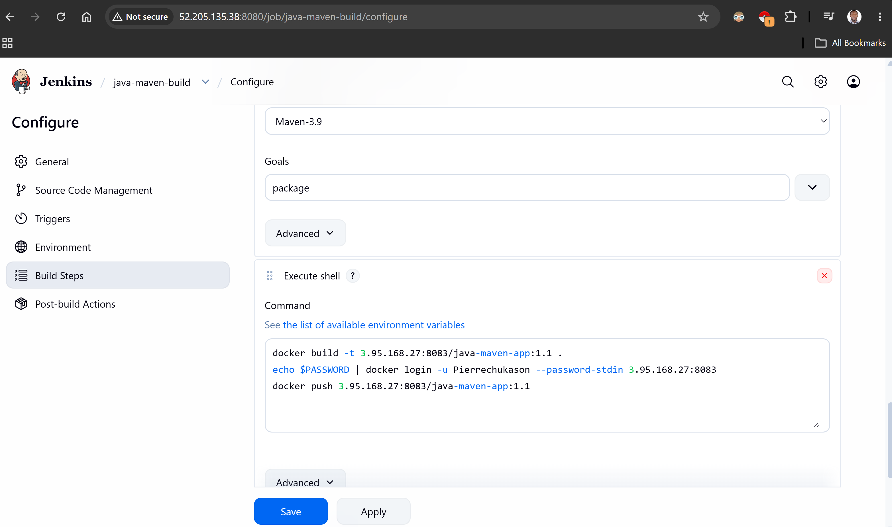

---

# Jenkinsfile

The project uses **Pipeline as Code**, where the entire CI process is defined inside a `Jenkinsfile`.

This makes the build process version-controlled, repeatable, and easy to maintain.

Typical pipeline stages include:

- Checkout
- Build
- Package
- Docker Build
- Docker Login
- Docker Push

### Jenkinsfile

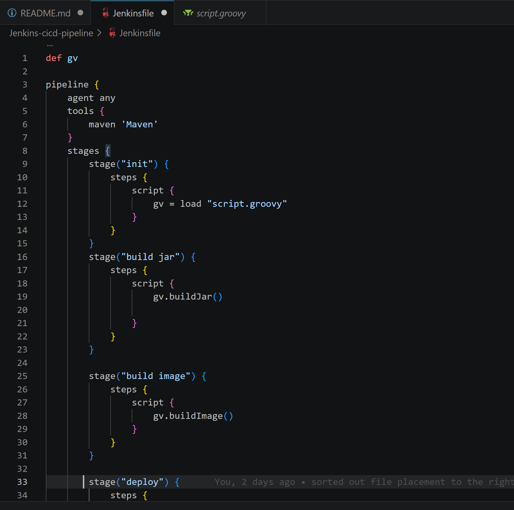

---

# Source Code Management

The application source code is hosted on GitHub and serves as the single source of truth for the Jenkins pipeline.

Every pipeline execution begins by cloning the latest version of the repository before starting the build process.

Version control ensures reproducibility, collaboration, and traceability of all project changes.

---

## GitHub Repository

The repository contains all project resources required for the CI pipeline.

### Key Files

- `Jenkinsfile`
- `Dockerfile`
- `pom.xml`
- Java Source Code
- README Documentation
- Supporting Documentation

### GitHub Repository

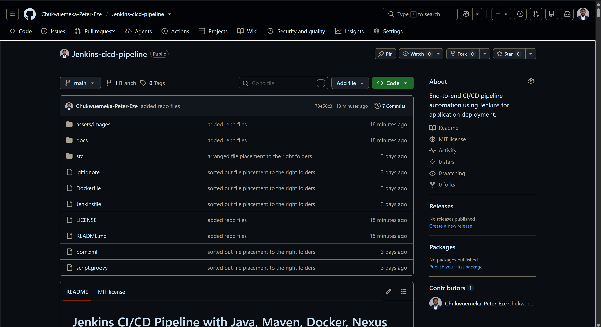

---

## Commit History

The commit history demonstrates incremental development throughout the project.

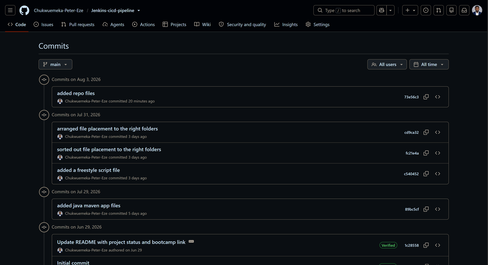

---

# Java Application

The sample application used throughout this project is a Java application managed using Apache Maven.

Jenkins automatically compiles and packages the application into an executable JAR file before creating the Docker image.

---

## Java Project Structure

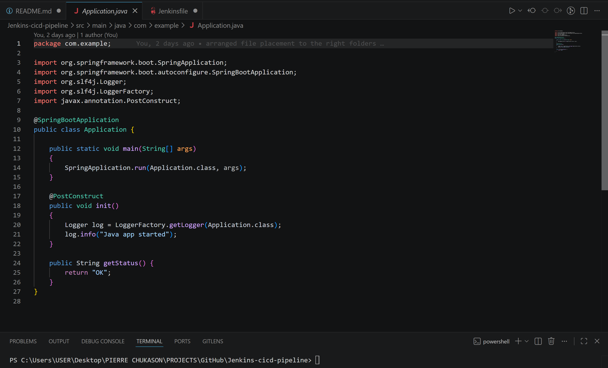

---

# Apache Maven

Apache Maven automates dependency management, project compilation, testing, and packaging.

Within this CI pipeline, Maven is responsible for transforming the Java source code into a deployable JAR artifact.

---

## Maven Build Lifecycle

This project primarily uses the following Maven phases:

| Phase | Description |
|--------|-------------|
| validate | Validates the project structure |
| compile | Compiles Java source code |
| test | Executes unit tests |
| package | Packages the application into a JAR |

---

## Maven Build Command

```bash
mvn package
```

---

## Successful Build Output

After executing the build, Maven generates the packaged application inside the `target/` directory.

Expected output:

```text
BUILD SUCCESS
```

---

## Successful Maven Build

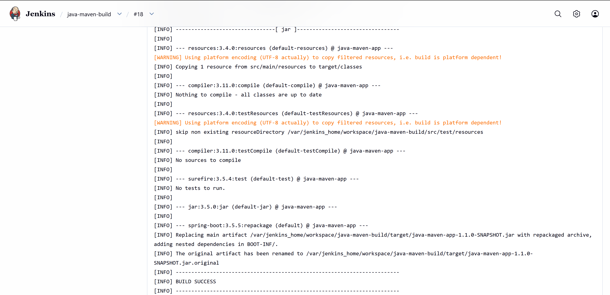

---

## Generated Target Directory

The generated executable JAR file is stored inside the `target` directory.


---

# Docker Containerization

Once Maven successfully packages the application, Docker builds a lightweight container image that can be deployed consistently across environments.

Containerization ensures that the application runs with the same dependencies regardless of the deployment environment.

---

## Docker Build Process

The Docker image is built automatically by Jenkins using the project's Dockerfile.

Example command:

```bash
docker build -t java-maven-app:1.1 .
```

---

## Dockerfile


---

## Docker Build Output

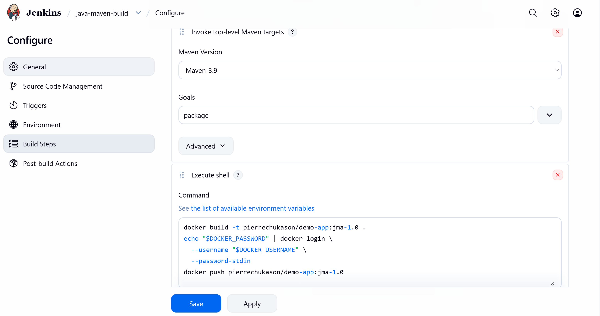

---

# Docker Image Verification

After building the application image, Docker stores it locally.

The available images can be verified using:

```bash
docker images
```

---

## Docker Images


---

# Running Docker Containers

Running containers can be inspected using:

```bash
docker ps
```

This confirms that the required services are active.

During this project, Docker was used to run:

- Sonatype Nexus Repository
- Supporting application containers

---

## Running Containers

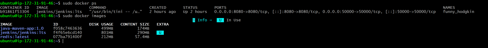

---

# Inspecting Docker Containers

Container details were verified using Docker inspection commands.

Examples include:

```bash
docker inspect nexus
```

```bash
docker logs <container-id>
```

```bash
docker exec -it <container-id> sh
```

These commands were essential during troubleshooting and debugging.

---

## Docker Logs


---

## Docker Inspect


---

# Docker Image Tagging

Before publishing to Nexus Repository, the Docker image was tagged using the repository endpoint.

Example:

```bash
docker tag java-maven-app:1.1 <NEXUS-IP>:8083/java-maven-app:1.1
```

Proper tagging ensures Docker knows the destination registry during image publication.

---

## Tagged Docker Image


---

# Sonatype Nexus Repository

To simulate an enterprise-grade artifact management workflow, **Sonatype Nexus Repository** was deployed on the AWS EC2 instance and configured as a **private Docker Registry**.

Instead of pushing Docker images to Docker Hub, the CI pipeline publishes images to a private Nexus Docker Hosted Repository. This approach improves security, provides greater control over artifacts, and mirrors how many organizations manage internal container images.

---

## Why Nexus Repository?

Using Nexus Repository provides several advantages:

- Centralized artifact management
- Private Docker Registry
- Secure image storage
- Version control for artifacts
- Integration with CI/CD pipelines
- Faster deployments using internal repositories
- Reduced dependency on public registries

---

## Nexus Login Page

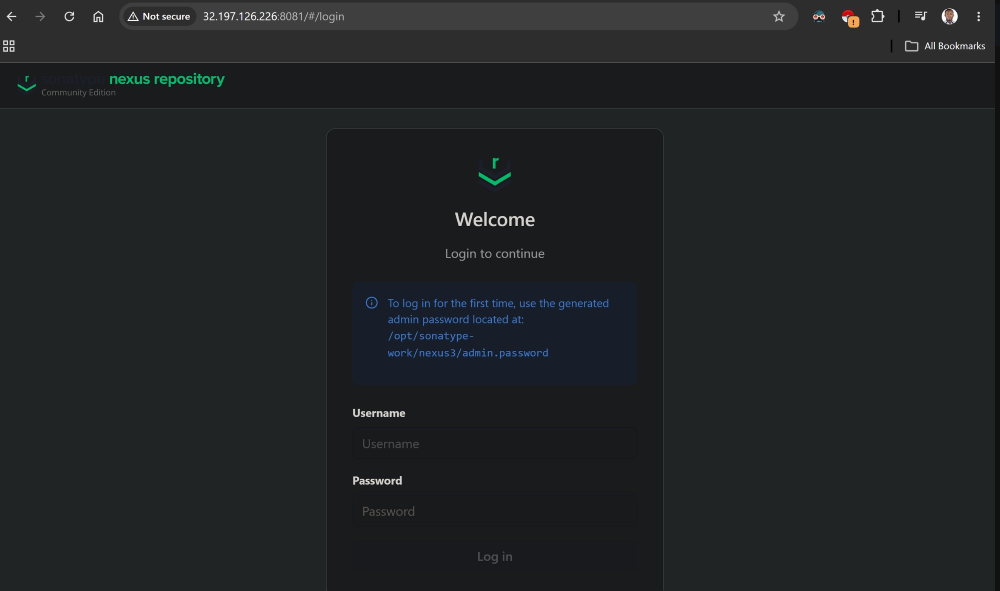

---

## Nexus Dashboard

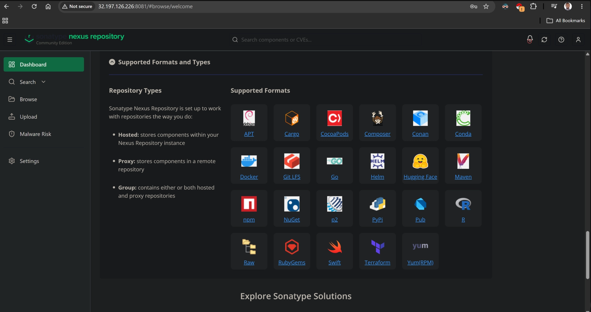

---

## Docker Hosted Repository

A Docker Hosted Repository was created to store application images generated by Jenkins.

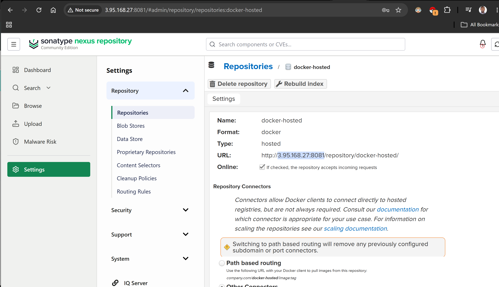

---

## Repository Configuration


---

# Authenticating with Nexus

Before Jenkins can push Docker images, Docker must authenticate against the private registry.

Example command:

```bash
docker login <EC2-PUBLIC-IP>:8083
```

Jenkins retrieves the Docker registry credentials securely from the Jenkins Credentials Store, preventing usernames and passwords from being hardcoded into the pipeline.

---

## Successful Docker Login


---

# Publishing Docker Images

After successful authentication, Jenkins pushes the Docker image to the private registry.

Example command:

```bash
docker push <EC2-PUBLIC-IP>:8083/java-maven-app:1.1
```

This completes the build stage by storing the deployable application image inside Nexus Repository.

---

## Docker Push

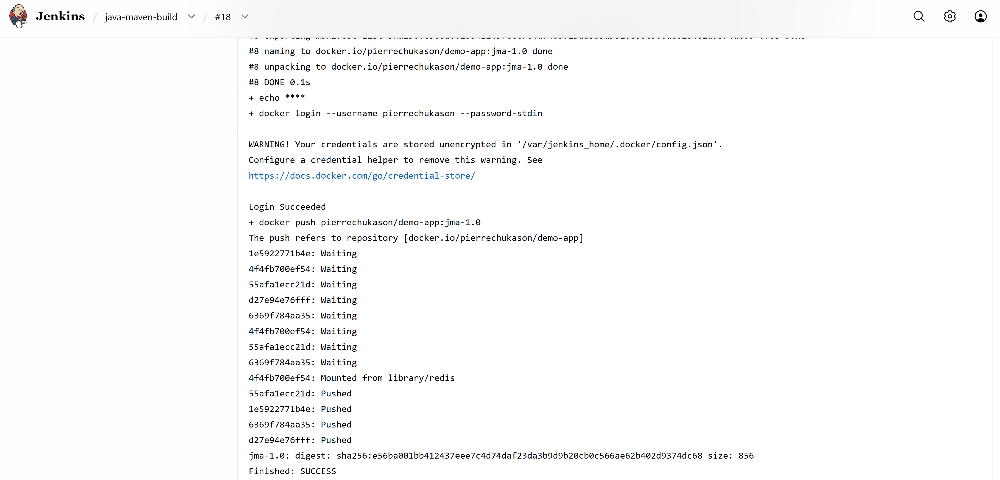

---

## Uploaded Docker Image

Once the push operation completes successfully, the image becomes available inside Nexus Repository.

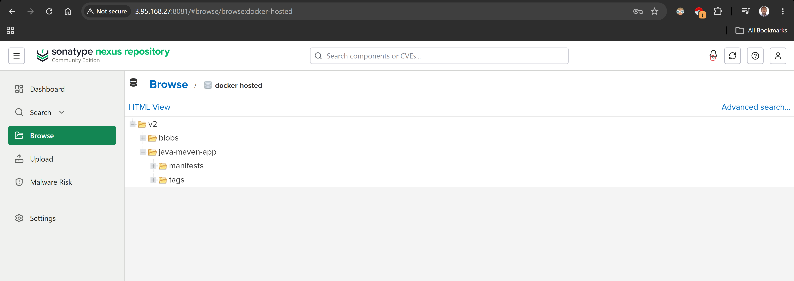

---

# Jenkins Pipeline Execution

The entire software delivery process is automated using a Jenkins Pipeline.

Each stage executes sequentially, ensuring that only successful builds progress to the next phase.

Pipeline Stages:

1. Checkout Source Code
2. Build Java Application
3. Package Application with Maven
4. Build Docker Image
5. Authenticate with Nexus Repository
6. Push Docker Image
7. Complete Build Successfully

This automation minimizes manual intervention while ensuring repeatable and reliable software builds.

---

## Pipeline Overview


---

## Build History

Jenkins records every build, making it easy to review previous executions, identify failures, and monitor pipeline health.

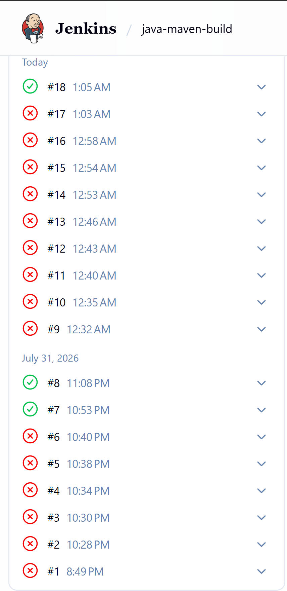

---

## Console Output

The Console Output provides detailed logs for every stage of the pipeline and serves as the primary troubleshooting resource during failed builds.


---

## Successful Pipeline Execution

This screenshot demonstrates a successful pipeline run from source code checkout to Docker image publication.


---

# CI Pipeline Summary

The completed CI workflow can be summarized as follows:

```text
Developer
     │
     ▼
Git Push
     │
     ▼
GitHub Repository
     │
     ▼
Jenkins Pipeline
     │
     ▼
Checkout Source Code
     │
     ▼
Compile Java Application
     │
     ▼
Maven Package
     │
     ▼
Docker Build
     │
     ▼
Docker Login
     │
     ▼
Docker Push
     │
     ▼
Sonatype Nexus Repository
     │
     ▼
Docker Image Available for Deployment
```

---

# Key Achievements

Throughout this project, I successfully:

- Configured Jenkins on an AWS EC2 Ubuntu instance.
- Integrated Jenkins with GitHub for automated source code retrieval.
- Automated Java application builds using Apache Maven.
- Containerized the application using Docker.
- Configured Sonatype Nexus Repository as a private Docker Registry.
- Authenticated Docker with Nexus using Jenkins Credentials.
- Published Docker images to a private registry.
- Diagnosed and resolved multiple real-world CI pipeline failures.
- Documented the complete implementation for future reference and portfolio demonstration.

---

# Troubleshooting

During the implementation of this project, I encountered several real-world challenges. Each issue required systematic investigation, log analysis, and iterative testing before arriving at a successful solution.

These troubleshooting experiences significantly improved my understanding of Jenkins, Docker, Linux, AWS networking, and Nexus Repository.

---

## Issue 1: Docker Permission Denied

### Error

```text
permission denied while trying to connect to the Docker daemon socket
```

### Root Cause

The current user did not have permission to communicate with the Docker daemon.

### Resolution

Executed Docker commands with elevated privileges using:

```bash
sudo docker <command>
```

Alternatively, add the Jenkins user to the Docker group:

```bash
sudo usermod -aG docker jenkins
sudo systemctl restart jenkins
```

### Screenshot


---

## Issue 2: `/bin/bash` Not Found

### Error

```text
OCI runtime exec failed:
exec: "/bin/bash": no such file or directory
```

### Root Cause

The Nexus container is based on Alpine Linux and does not include Bash.

### Resolution

Connected using the default shell:

```bash
docker exec -it <container-id> sh
```

### Screenshot


---

## Issue 3: Vim Could Not Save File

### Error

```text
E45: 'readonly' option is set
```

### Root Cause

The file was opened without write permission.

### Resolution

Reopened the file using sudo:

```bash
sudo vim filename
```

or

```bash
:w !sudo tee %
```

### Screenshot


---

## Issue 4: Docker Login Timeout

### Error

```text
Client.Timeout exceeded while awaiting headers
```

### Root Cause

The Docker Registry endpoint was unreachable due to networking or port configuration.

### Resolution

- Verified Nexus container status.
- Confirmed Docker Registry connector configuration.
- Checked AWS Security Groups.
- Verified Docker port mapping.

### Screenshot


---

## Issue 5: 404 Not Found

### Error

```text
404 Not Found
```

### Root Cause

Docker was attempting to authenticate against the wrong endpoint or incorrect port.

### Resolution

Configured Docker Hosted Repository correctly and used the appropriate Docker connector port.

### Screenshot


---

## Issue 6: Connection Refused

### Error

```text
dial tcp ... connect: connection refused
```

### Root Cause

The Docker Registry connector was not listening on the expected port.

### Resolution

- Verified Nexus configuration.
- Confirmed Docker connector port.
- Restarted Nexus container.
- Validated port mapping using:

```bash
sudo ss -tlnp
```

### Screenshot


---

## Issue 7: 401 Unauthorized

### Error

```text
401 Unauthorized
```

### Root Cause

Incorrect Docker Registry credentials.

### Resolution

Used the built-in Nexus administrator account with the correct username and password stored securely in Jenkins Credentials.

### Screenshot


---

# Important Commands Practiced

Throughout this project, I practiced a wide range of Linux, Git, Docker, Maven, and Jenkins commands.

## Git

```bash
git clone
git add .
git commit -m "message"
git push origin main
git pull origin main
```

---

## Maven

```bash
mvn clean
mvn compile
mvn test
mvn package
```

---

## Docker

```bash
docker build
docker images
docker ps
docker ps -a
docker logs
docker exec
docker inspect
docker login
docker push
docker tag
docker stop
docker start
```

---

## Linux

```bash
sudo systemctl status jenkins
sudo systemctl restart jenkins
sudo ss -tlnp
sudo netstat -tlnp
chmod
chown
vim
cat
ls
pwd
cd
```

---

# Key Concepts Learned

Throughout this project, I gained practical experience with:

- Continuous Integration (CI)
- Pipeline as Code
- Jenkins Jobs
- Jenkins Pipelines
- Groovy Pipeline Syntax
- Git Integration
- Maven Build Lifecycle
- Docker Images
- Docker Containers
- Docker Registry
- Sonatype Nexus Repository
- Artifact Management
- AWS EC2 Administration
- Linux System Administration
- SSH
- Troubleshooting CI/CD Pipelines

---

# Lessons Learned

This project reinforced several important engineering principles:

- Automation improves consistency and reduces manual effort.
- Logs are the first place to investigate pipeline failures.
- Small configuration mistakes can prevent an entire CI pipeline from succeeding.
- Linux fundamentals are essential for DevOps engineering.
- Secure credential management is critical for production pipelines.
- Documentation is as valuable as implementation.
- Troubleshooting is a core DevOps skill and often requires patience, observation, and iterative testing.

---

# Future Improvements

Possible enhancements for this project include:

- Implement Continuous Deployment (CD) after the CI pipeline.
- Deploy the Docker image to Kubernetes.
- Integrate SonarQube for code quality analysis.
- Add automated unit and integration testing.
- Integrate Trivy for container image vulnerability scanning.
- Configure email and Slack notifications.
- Store secrets using HashiCorp Vault or AWS Secrets Manager.
- Deploy the application using Helm charts.
- Introduce Infrastructure as Code with Terraform.

---

# Skills Demonstrated

This project demonstrates practical experience with:

### Cloud

- AWS EC2
- Security Groups
- SSH

### DevOps

- Jenkins
- Docker
- Maven
- Nexus Repository
- CI Pipelines

### Linux

- User Management
- File Permissions
- Networking
- Services
- Process Management

### Version Control

- Git
- GitHub

### Documentation

- Markdown
- Technical Writing
- Architecture Documentation
- Troubleshooting Documentation

---

# Related Documentation

Additional project documentation is available in the `docs` directory:

- `setup.md`
- `commands.md`
- `troubleshooting.md`
- `lessons-learned.md`
- `project-structure.md`
- `video-script.md`

---

# Author

**Chukwuemeka Peter Eze**

Cloud Security & DevOps Engineer

GitHub: https://github.com/Chukwuemeka-Peter-Eze

LinkedIn: https://www.linkedin.com/in/chukwuemekapetereze/

---

# License

This project is licensed under the MIT License.

---

# Acknowledgements

Special thanks to the open-source community and the creators of the technologies used in this project:

- Jenkins
- Apache Maven
- Docker
- Sonatype Nexus Repository
- Git
- GitHub
- Amazon Web Services (AWS)

Their tools and documentation made this hands-on learning experience possible.

---

⭐ If you found this project helpful or interesting, consider giving the repository a star to support my learning journey.

